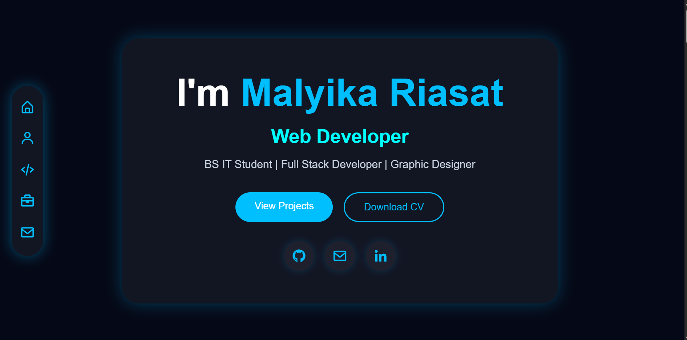
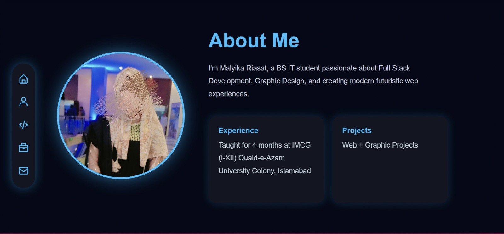
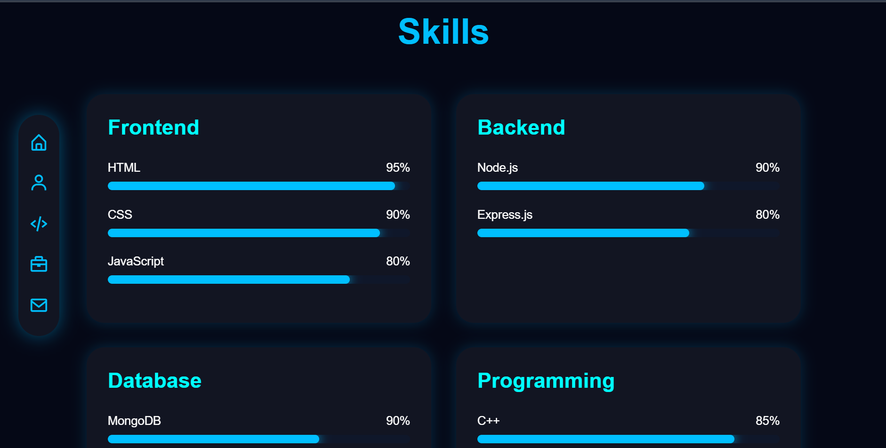
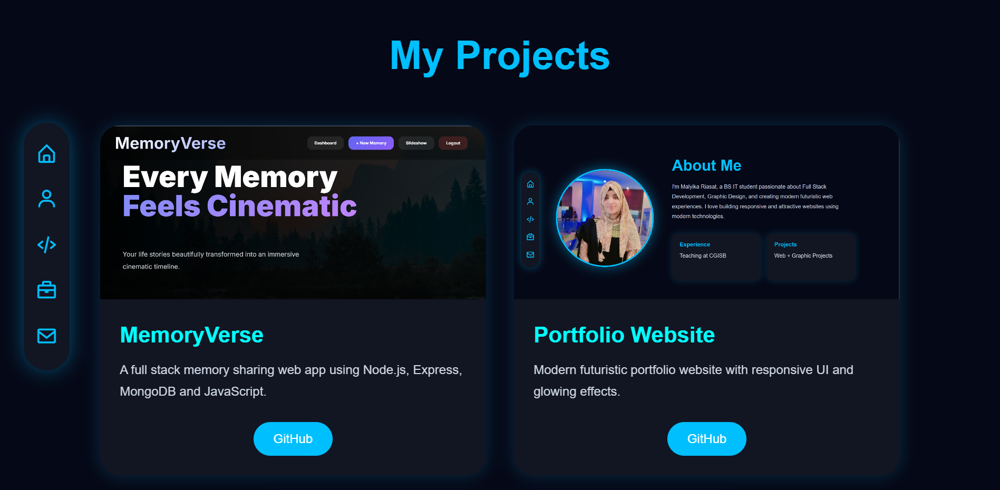
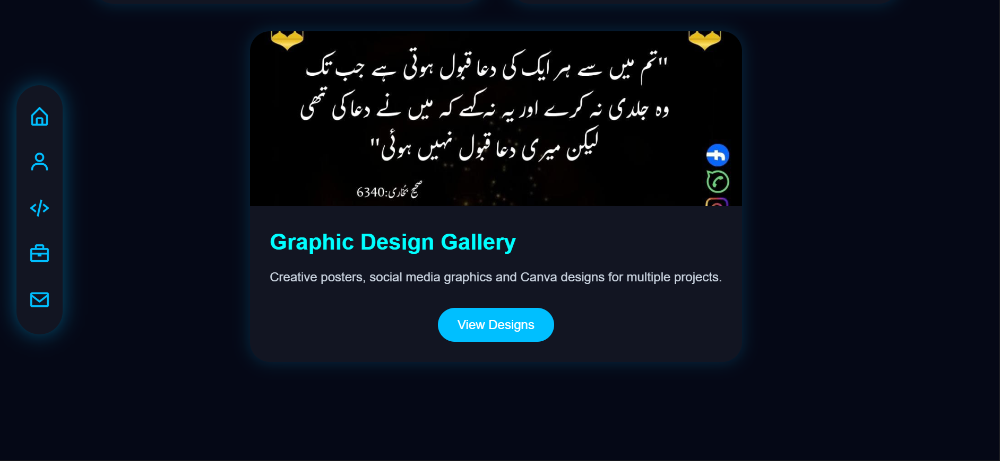
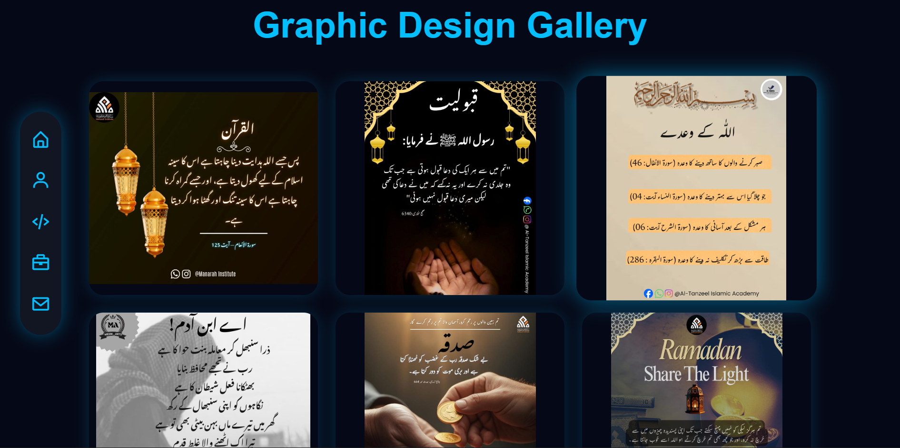
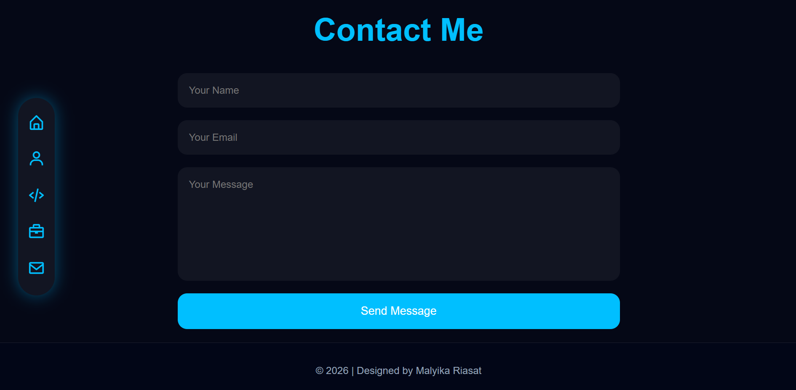
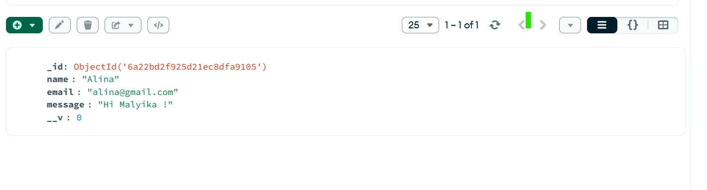

# Malyika Portfolio

A modern full-stack portfolio website built using:
- HTML
- CSS
- JavaScript
- Node.js
- Express.js
- MongoDB

## Features
- Responsive Design
- Contact Form with MongoDB
- Graphic Design Gallery
- Download CV
- GitHub & LinkedIn Integration

## Screenshots

### Home

### About

### Skills

### Projects (Part 1)

### Projects (Part 2)

### Graphic Design Gallery

### Contact

## Database Integration

Contact form submissions are stored in MongoDB.

